Containerizing the entire CI/CD implementation makes it highly portable and easy to manage. This involves running Jenkins, SonarQube, Prometheus, Grafana, and potentially even Kubernetes (via Minikube or Kind) inside containers. We will also set up a Jenkins master and slave architecture within this containerized environment. Here's how to proceed:

# 1. Docker Compose for CI/CD Tools Setup

Create a custom Jenkins Slave Docker Image by creating a `Dockerfile`:

```
FROM jenkins/inbound-agent:latest
USER root
RUN apt-get update && \
    apt-get install -y openssh-server maven && \
    mkdir /var/run/sshd && \
    echo 'root:root' | chpasswd && \
    sed -i 's/PermitRootLogin prohibit-password/PermitRootLogin yes/' /etc/ssh/sshd_config && \
    sed -i 's/#PasswordAuthentication yes/PasswordAuthentication yes/' /etc/ssh/sshd_config && \
    service ssh start
EXPOSE 22
CMD ["/usr/sbin/sshd", "-D"]
```

This image will include the SSH and necessary tools.
Then build the custom image with the following command: `docker build -t custom-jenkins-slave .`
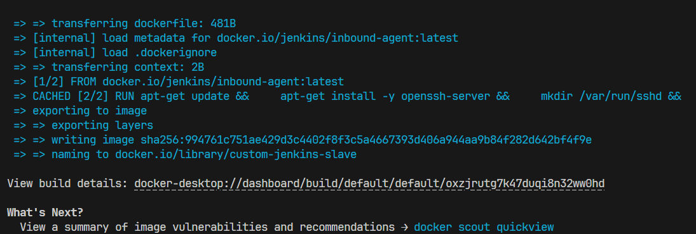

Create a `docker-compose.yml` file to define and run multi-container Docker applications. We'll set up Jenkins (master and slave), SonarQube, Prometheus, and Grafana. Kubernetes nodes will be set up separately using Kind for local environments.

**_Docker Compose Setup_**

```
version: '3.8'
services:
jenkins-master:
image: jenkins/jenkins:lts
ports: - "8080:8080" - "50000:50000"
volumes: - jenkins-data:/var/jenkins_home - /var/run/docker.sock:/var/run/docker.sock
environment: - JENKINS_SLAVE_AGENT_PORT=50000

jenkins-slave:
image: jenkins/inbound-agent
depends_on: - jenkins-master
environment: - JENKINS_URL=http://jenkins-master:8080 - JENKINS_AGENT_NAME=slave01 - JENKINS_SECRET=jenkins-agent-secret - JENKINS_AGENT_WORKDIR=/home/jenkins/agent

sonarqube:
image: sonarqube:latest
ports: - "9000:9000"
volumes: - sonarqube-data:/opt/sonarqube/data - sonarqube-logs:/opt/sonarqube/logs - sonarqube-extensions:/opt/sonarqube/extensions

prometheus:
image: prom/prometheus
volumes: - ./prometheus.yml:/etc/prometheus/prometheus.yml
ports: - "9090:9090"

grafana:
image: grafana/grafana
ports: - "3000:3000"
volumes: - grafana-storage:/var/lib/grafana

volumes:
jenkins-data:
sonarqube-data:
sonarqube-logs:
sonarqube-extensions:
grafana-storage:
```

**_Explanation:_**

- Jenkins Master and Slave: Sets up Jenkins master and a connected slave for distributed builds. Jenkins slave connects to the master using the specified environment variables.
- SonarQube: Runs SonarQube for continuous code quality checks.
- Prometheus and Grafana: Setup for monitoring your CI/CD pipeline and infrastructure.

To start up the environment in the docker compose file run the following command: `docker-compose up -d --build`

Then to make sure that all environments have been started, you can confirm by running the following command: `docker-compose ps`

## Setup Prometheus

First create a `prometheus.yml` file for the lab implementation setup, here is a basic configuration file for Prometheus that you can use. This file will help you get started by scraping the metrics from your existing services:

```
global:
  scrape_interval: 15s # By default, scrape targets every 15 seconds.

scrape_configs:
  - job_name: 'prometheus'
    static_configs:
      - targets: ['localhost:9090']

  - job_name: 'jenkins-master'
    static_configs:
      - targets: ['jenkins-master:8080']

  - job_name: 'jenkins-slave'
    static_configs:
      - targets: ['jenkins-slave:50000']

  - job_name: 'sonarqube'
    static_configs:
      - targets: ['sonarqube:9000']

  - job_name: 'grafana'
    static_configs:
      - targets: ['grafana:3000']
```

# 2. Kubernetes Cluster Setup using Kind

Kind (Kubernetes in Docker) is particularly useful for local development. Install Kind and set up a local Kubernetes cluster.

**_Kind Configuration_**
kind: Cluster
apiVersion: kind.x.y
nodes:

- role: control-plane
- role: worker
- role: worker

Run the command to create a cluster:
`kind create cluster --config kind-config.yaml`

# 3. Networking and Volumes

The Docker Compose setup maps necessary ports and uses named volumes to persist data for Jenkins, SonarQube, and Grafana, ensuring data remains intact across container restarts. For a more robust setup, you may consider using Docker networks to isolate and manage communication between services.

# 4. CI/CD Pipeline Integration

Once all services are up and running, configure Jenkins to manage builds, test deployments in the Kubernetes cluster managed by Kind, analyze code via SonarQube, and monitor using Prometheus and Grafana. You'll need to configure Jenkins jobs to recognize your Kubernetes cluster via kubectl configured in the Jenkins master or slave nodes.

# 5. Testing and Validation

After setting up, run a few test builds to ensure that Jenkins can orchestrate builds across the Jenkins slave, deploy to Kubernetes, SonarQube can analyze the code, and Prometheus and Grafana can display the metrics.

# 6. Tear Down and Spin Up

You can easily tear down the entire setup with Docker Compose and Kind commands:
`docker-compose down -v
kind delete cluster`

After successfully setting up your environment using Docker Compose and Kind, the next steps involve configuring and integrating the services to form a cohesive CI/CD pipeline. Here’s how to proceed with the complete setup:

# Step 1: Verify Service Availability

1. Check Containers: Ensure all containers are up and running correctly:
   `docker-compose ps`
   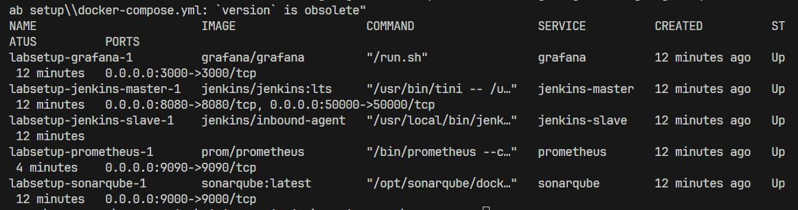

2. Access Services: Verify that Jenkins, SonarQube, Prometheus, and Grafana are accessible via their respective ports:

- Registry: http://localhost:5000/
- Jenkins: http://localhost:8080
- SonarQube: http://localhost:9000
- Prometheus: http://localhost:9090
- Grafana: http://localhost:3000

# Step 2: Configure Jenkins

1. Initial Setup:

- Open Jenkins in your browser and get the the password.
  - Open the browser and enter the following address `localhost:8080`
    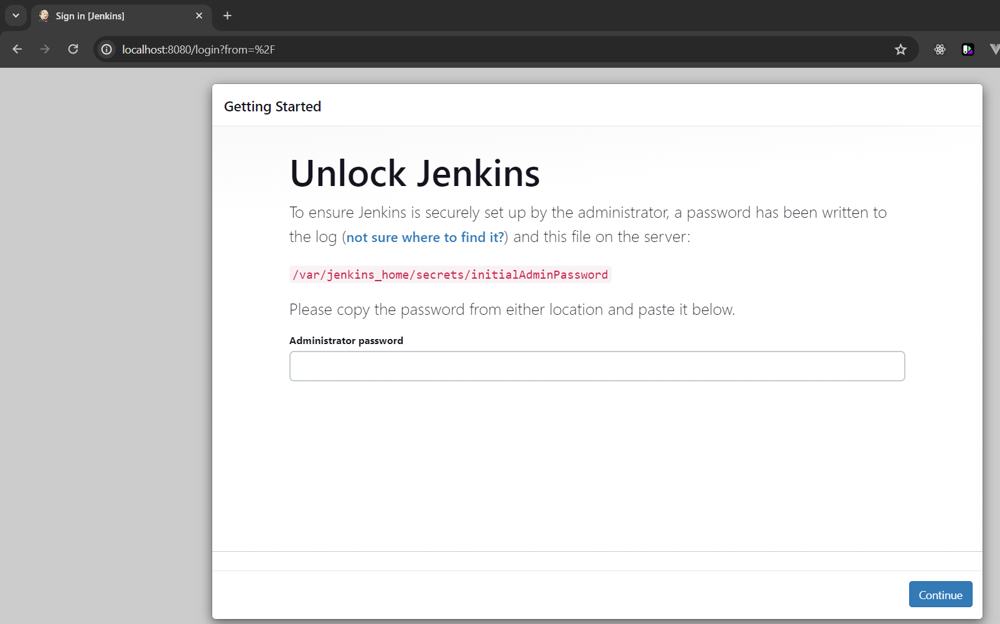
  - Open Docker and navigate to the Container in the side menu, under the `labsetup` container open the logs for `labsetup-jenkins-master-1` and copy the password and paste it within the password field within the browser.
    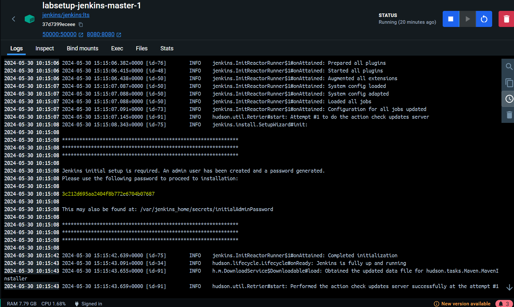
  - Next click on `Install suggested plugins`
    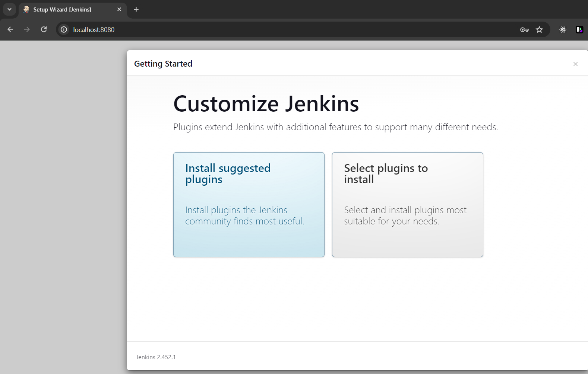
    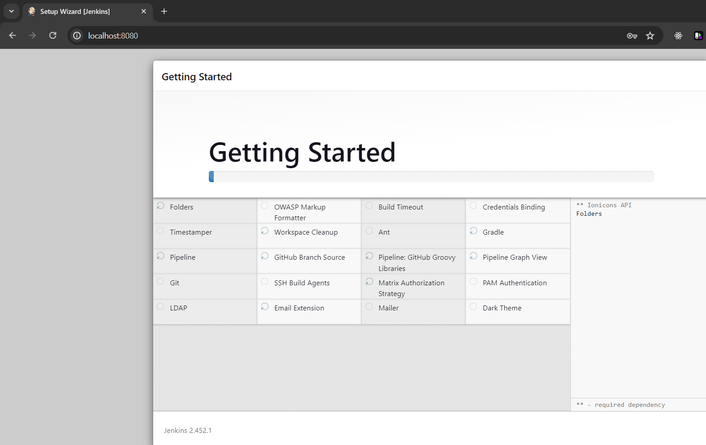
  - Configure the your admin user credentials
    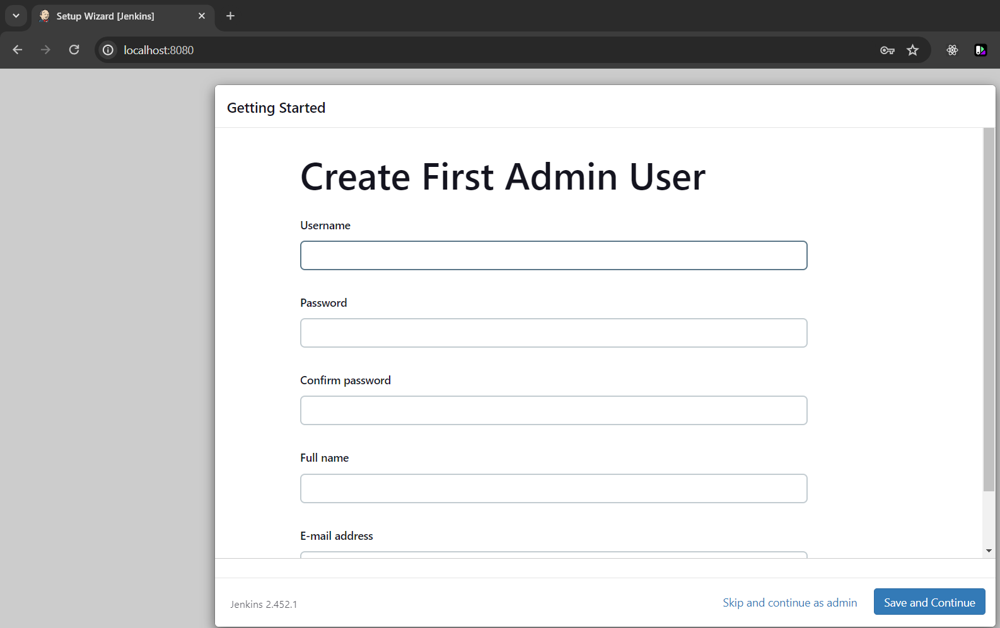
- 
- Complete the initial setup wizard, install suggested plugins, and create an admin user.

2. Configure Plugins

- Go to Manage Jenkins > Manage Plugins.
- Ensure plugins for Git, Docker, Docker Pipeline Kubernetes, Prometheus, Sonarcube and any others you anticipate needing (such as Github Pipeline, GitHub) are installed.
  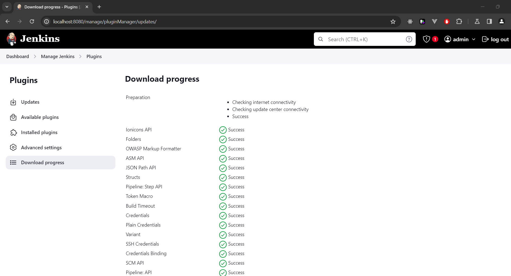

3.  Add Jenkins Slave:
    3.1 Configure and Generate the SSH Keys:
1.  Generate SSH Key on the Jenkins Master Container:

    - SSH into your Jenkins master container, first get the container ID:
      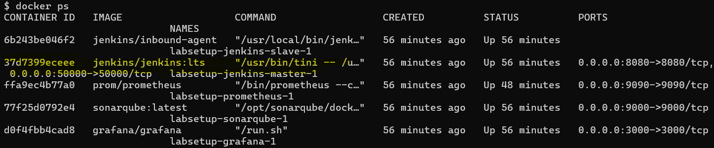
      

    - Generate the SSH key pair (do not set a passphrase) `ssh-keygen -t rsa -b 4096 -f /var/jenkins_home/.ssh/id_rsa`:
      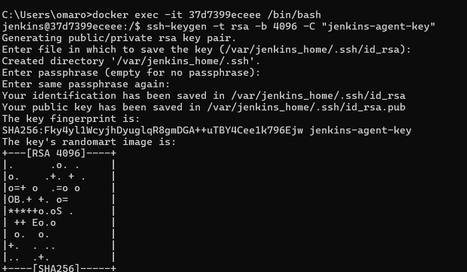

    - This will create a public key (~/.ssh/id_rsa.pub) and a private key (~/.ssh/id_rsa).

1.  Copy the Public Key to the Jenkins Slave Container:
    Get the public key on the master with the following command: `cat /var/jenkins_home/.ssh/id_rsa.pub
    ```
    docker exec -it --user root labsetup-jenkins-slave-1 /bin/bash
    echo "ssh-rsa AAAAB3NzaC1yc2EAAAADAQABAAACAQDTlEQf2ApgrFIbIKENt611AQkeNbtU9WYJ4ejaZ9HfwjXL0Anb6r5eZUegPZEXV1OTraSQdFB+T5xu8KUyN44/VpRZz45TCmUzL9Z+0vwYfG7AQCgm07l0XjiKStKfVCyLuyRlZThXkMdysEQQhSHJ3tggPuhPgknzxKIGWOQR724iaB/pik7ywAhbTDMf4X4WSr7/PYWvF4HdxgOz84yzGEoyyPEzqilzS7xipnV21uaEkCmLu6bjEVsAliVMi9THp8yc6SbmIpZiewVu5Gfgb6E5Ok9vy3eSRnPO/jPpbtHgLmyAU3I8GMemVpFv2HrEC09rtAQzkqMKV1q1K2qnqWZAuM0ZM9zJRqKaFIq3n1JahLcvUcaoaI9F6HWdObfDpHGa0P2NC0I06CSBpGet8tWOSQ5FsExBPG4jijeFm2aCm4xaCz696Fe4waqS7fOgexrIJBQwsRHpzEZfn8Q874oPJ84D4fBQC/hSucgo2/TbN2sEDC3TZYqhJxKDnJOUOAXa6HR0cuzjweh9G9NvXMzaSJsPilXpRE0wY9ZGaksvUKdXFJVmY9HqVhOjeZluRzMNTYugWQtAbArf/wt6sX4+KZ2N1rqaBeWcQnbqYdNgbYLFDok3nrNXpafNHpGic2hfvlOTOxyU/6igo2Se/FxDT7n6JF01eaqnv1PvKQ== jenkins@5d9fbf00675e" >> /root/.ssh/authorized_keys
    ```
    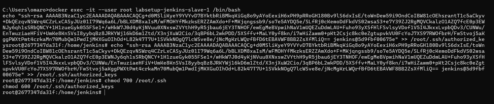

# Step 3: Update Jenkins Node Configuration

- In Jenkins, navigate to Manage Jenkins > Manage Nodes and Clouds.
- Click on New Node, enter a name for your slave, select Permanent Agent, and configure it with the necessary parameters, such as the remote root directory and labels.
- 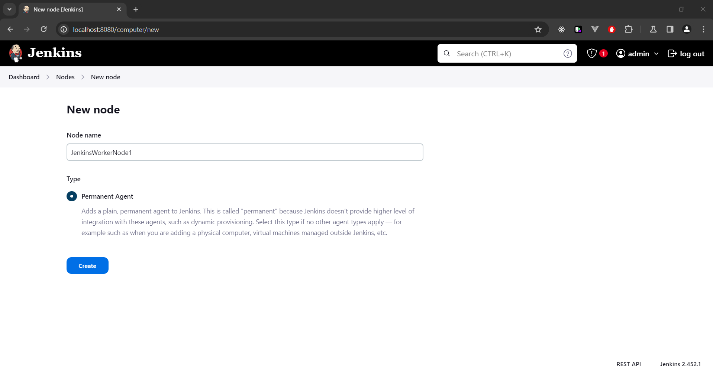
- Configure Node:
  - Fill in the following details for your node:
  - Name: `jenkins-slave` (or the name you provided)
  - Description: A description for your slave node (optional)
  - No. of Executors: The number of executors to use (usually 1)
  - Remote root directory: /home/jenkins
  - Labels: Any labels you want to use to tag this node (e.g., slave, linux)
  - Usage: Use this node as much as possible
  - Launch method: Launch agents via SSH
- **SSH Connection Details\***:

  - Fill in the SSH connection details:
    - Host: `jenkins-slave` (ensure this matches the service name in Docker Compose)
    - Credentials: Click Add > Jenkins and select SSH Username with private key.
    - Username: `root`
    - Private Key: Select `Enter directly` and paste the private key content.
    - Copy the private key content from your master node and paste it here.
    - Click `Add` after entering the credentials.

- Host Key Verification Strategy:
  - Set the `Host Key Verification` Strategy to `Non verifying Verification Strategy`.
    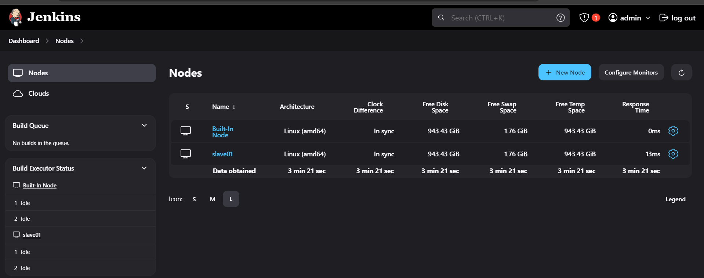

# Step 4: Create the Jenkins Pipeline
