### 1. Preparing the Environment

#### Required Tools and Services:

- **Docker**: Ensure Docker is installed on your system. You can download and install Docker from [Docker's official website](https://www.docker.com/get-started).
- **Docker Compose**: This is used to manage multi-container applications. It is typically included with Docker Desktop for Windows and Mac. For Linux, follow the instructions [here](https://docs.docker.com/compose/install/).
- **Git**: Required for source control management. Install from [git-scm.com](https://git-scm.com/downloads).

### 2. Setup Docker Compose for CI/CD Tools

#### Creating the Docker Compose File:

Create a `docker-compose.yml` file in your project directory. This file defines your CI/CD services including Jenkins, SonarQube, Prometheus, Grafana, and a private registry.

```yaml
version: "3.8"
services:
  jenkins-master:
    image: jenkins/jenkins:lts
    ports:
      - "8080:8080"
      - "50000:50000"
    volumes:
      - jenkins-data:/var/jenkins_home
      - /var/run/docker.sock:/var/run/docker.sock
    environment:
      - JENKINS_SLAVE_AGENT_PORT=50000

  jenkins-slave:
    image: custom-jenkins-slave
    depends_on:
      - jenkins-master
    environment:
      - JENKINS_URL=http://jenkins-master:8080
      - JENKINS_AGENT_NAME=slave01
      - JENKINS_SECRET=jenkins-agent-secret
      - JENKINS_AGENT_WORKDIR=/home/jenkins/agent
    ports:
      - "2222:22"

  sonarqube:
    image: sonarqube:latest
    ports:
      - "9000:9000"
    volumes:
      - sonarqube-data:/opt/sonarqube/data
      - sonarqube-logs:/opt/sonarqube/logs
      - sonarqube-extensions:/opt/sonarqube/extensions

  prometheus:
    image: prom/prometheus
    volumes:
      - ./prometheus.yml:/etc/prometheus/prometheus.yml
    ports:
      - "9090:9090"

  grafana:
    image: grafana/grafana
    ports:
      - "3000:3000"
    volumes:
      - grafana-storage:/var/lib/grafana

volumes:
  jenkins-data:
  sonarqube-data:
  sonarqube-logs:
  sonarqube-extensions:
  grafana-storage:
```

#### Build Custom Jenkins Slave Image:

Create a Dockerfile for the Jenkins slave:

```Dockerfile
FROM jenkins/inbound-agent:latest

USER root

# Install OpenSSH server, Java 11, Maven, and Docker
RUN apt-get update && \
    apt-get install -y openssh-server wget curl && \
    mkdir /var/run/sshd && \
    echo 'root:root' | chpasswd && \
    sed -i 's/PermitRootLogin prohibit-password/PermitRootLogin yes/' /etc/ssh/sshd_config && \
    sed -i 's/#PasswordAuthentication yes/PasswordAuthentication yes/' /etc/ssh/sshd_config && \
    mkdir -p /home/jenkins/.ssh && \
    chown -R jenkins:jenkins /home/jenkins/.ssh && \
    chmod 700 /home/jenkins/.ssh && \
    wget https://download.java.net/openjdk/jdk11/ri/openjdk-11+28_linux-x64_bin.tar.gz -O /tmp/openjdk.tar.gz && \
    tar -xzf /tmp/openjdk.tar.gz -C /opt && \
    ln -s /opt/jdk-11 /opt/jdk11 && \
    update-alternatives --install /usr/bin/java java /opt/jdk11/bin/java 1 && \
    update-alternatives --set java /opt/jdk11/bin/java && \
    (rm -f /etc/ssh/ssh_host_rsa_key || true) && \
    ssh-keygen -t rsa -b 4096 -f /etc/ssh/ssh_host_rsa_key -N '' && \
    (rm -f /root/.ssh/id_rsa || true) && \
    ssh-keygen -t rsa -b 4096 -f /root/.ssh/id_rsa -N '' && \
    cat /root/.ssh/id_rsa.pub >> /root/.ssh/authorized_keys && \
    chmod 600 /root/.ssh/authorized_keys && \
    curl -o /tmp/apache-maven-3.9.7-bin.tar.gz https://downloads.apache.org/maven/maven-3/3.9.7/binaries/apache-maven-3.9.7-bin.tar.gz && \
    tar -xvzf /tmp/apache-maven-3.9.7-bin.tar.gz -C /opt && \
    ln -s /opt/apache-maven-3.9.7 /opt/maven && \
    ln -s /opt/maven/bin/mvn /usr/bin/mvn && \
    curl -fsSL https://get.docker.com -o get-docker.sh && \
    sh get-docker.sh && \
    usermod -aG docker jenkins

# Update PATH
ENV PATH=$PATH:/usr/bin

# Copy entrypoint script
COPY entrypoint.sh /entrypoint.sh
RUN chmod +x /entrypoint.sh

EXPOSE 22
ENTRYPOINT ["/entrypoint.sh"]
```

Build the image with:

```bash
docker build -t custom-jenkins-slave .
```

### 3. Launch the Environment

Run the following command in the directory containing your `docker-compose.yml`:

```bash
docker-compose up -d --build
```

### 4. Configure Jenkins

#### Initial Jenkins Setup

1. **Access Jenkins**: Open your web browser and go to `http://localhost:8080`. You'll be prompted to unlock Jenkins using an initial admin password.
2. **Retrieve the Admin Password**: Access this by checking the logs of your Jenkins master container:
   ```bash
   docker logs jenkins-master-1
   ```
3. **Install Suggested Plugins**: Choose the suggested plugins to install, which includes basic plugins for building projects.
4. **Create Admin User**: Follow the instructions to create an admin user account.

#### Configure Plugins and Slave

1. **Install Additional Plugins**: Navigate to **Manage Jenkins > Manage Plugins** and install any additional necessary plugins (Git, Docker Pipeline, SonarQube Scanner, Kubernetes if needed).
2. **Add Jenkins Slave**:
   - Go to **Manage Jenkins > Manage Nodes and Clouds > New Node**.
   - Enter a node name (e.g., 'jenkins-slave'), select **Permanent Agent**, then click **OK**.
   - Configure the node:
     - Remote root directory: `/home/jenkins`
     - Labels: `slave`
     - Launch method: **Launch agents via SSH**
     - Host: `jenkins-slave`
     - Credentials: Add SSH private key here (you'll need to add credentials by selecting **Add > Jenkins**).
3. On the Jenkins home screen click on **_+ New Item_**
   - Give the job a name and also click on the **_Pipeline_** option in the list then click the Ok button.
     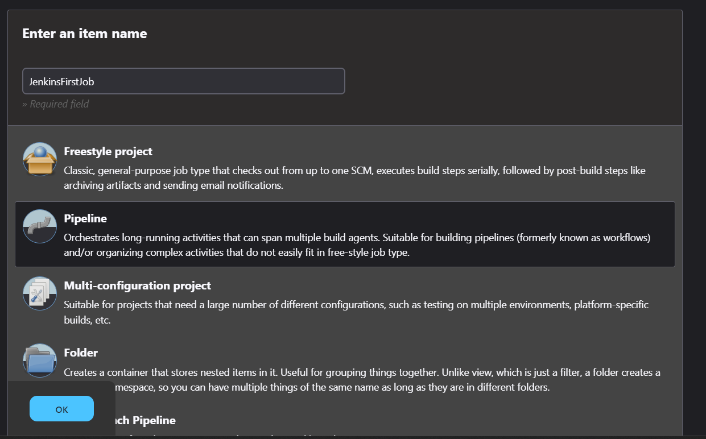
   - Scroll until the you reach the `Pipeline` section change the Definition to `Pipeline script from SCM`, add the following `Repository URL` "https://github.com/ogeeDeveloper/Jenkins_Upgradev3.git".
     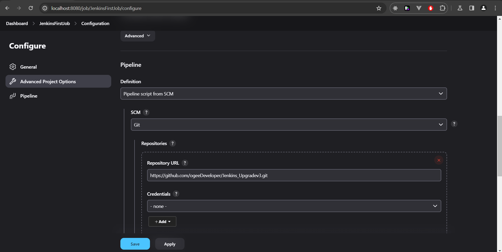
   - Leave the branch as `master` add this `reusable-pipelines/Powering_Pipeline_with_Docker/jenkinsfiletestcicdimplementation1` as the `Script Path`, this will be the location of the Jenkinsfile to run the pipeline.
     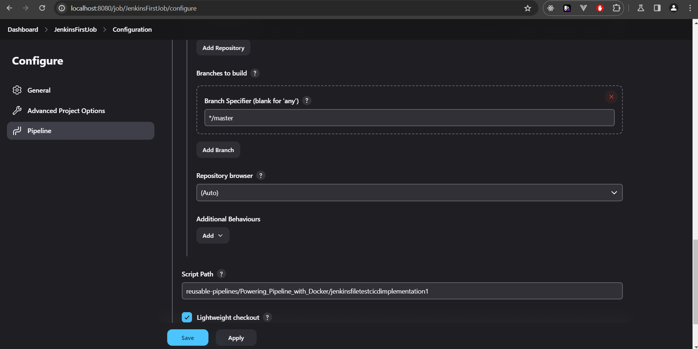

### 5. Setup SonarQube

SonarQube is integrated into our Docker Compose setup to ensure continuous inspection of code quality. Follow these steps to configure SonarQube for use with Jenkins:

1. **Access SonarQube**:

   - After launching your services with Docker Compose, access SonarQube by navigating to `http://localhost:9000`.
     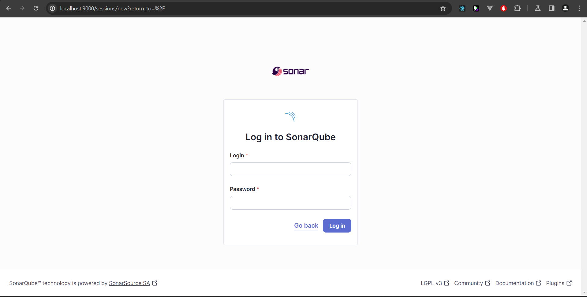
   - Default login credentials are `admin` for username and `admin` for password. You are advised to change these during your first login.
     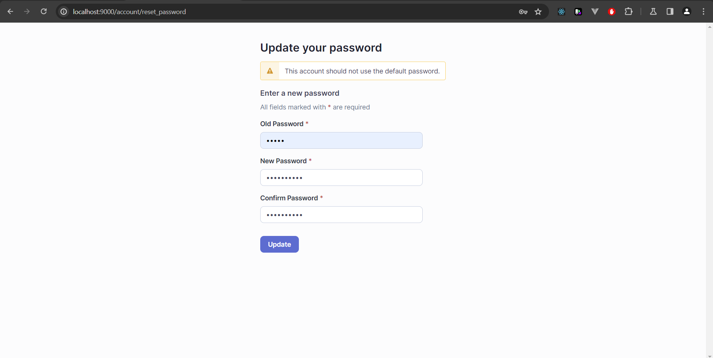

2. **Create a SonarQube Token**:

   - Navigate to **My Accounts**, then click the **Security** tab.
     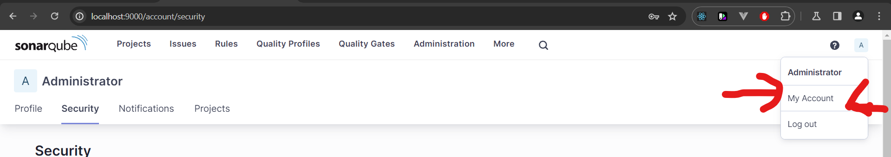
   - Enter your chosen name for the token and set the type to **_Global Analysis Token_**, you can leave the expiration type as default then generate a token which will be used in Jenkins to authenticate.
     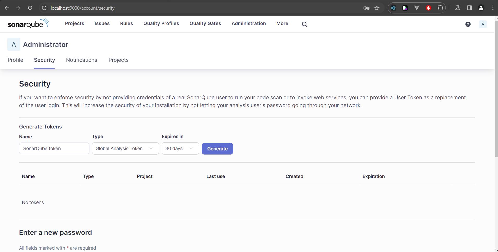

3. **Configure SonarQube in Jenkins**:

   - Install the **SonarQube Scanner** plugin in Jenkins via **Manage Jenkins > Manage Plugins**.
   - Go to **Manage Jenkins > Configure System**, find the **SonarQube servers** section, and add your SonarQube server:
     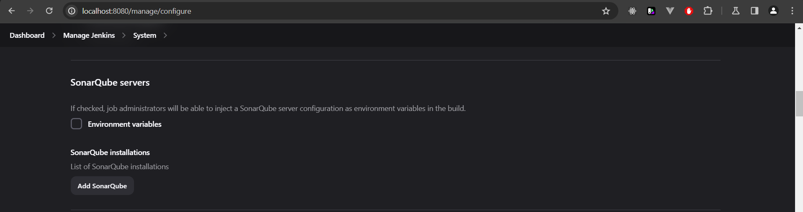
     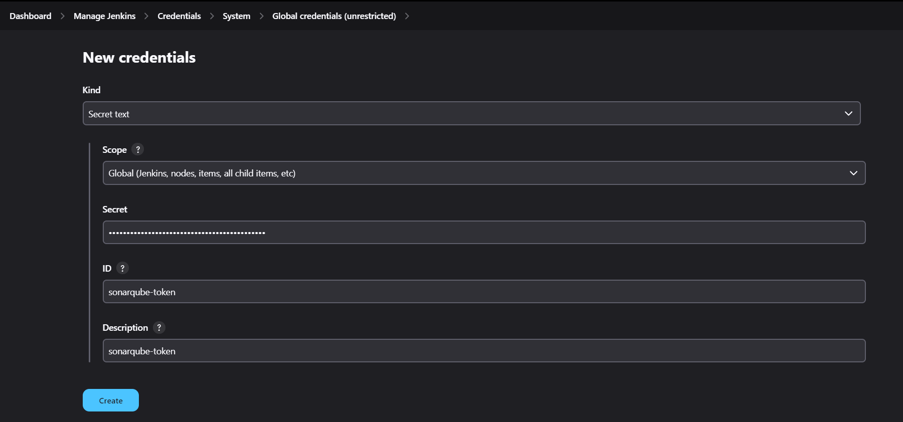
     - **Name**: SonarQubeScanner-6.0.0
     - **Server URL**: `http://sonarqube:9000`
     - **Server authentication token**: Paste the token generated from SonarQube.
     - Then click the `Apply` and ``Save` button to finish adding the SonarQube server to Jenkins.

4. **Configure SonarQube Scanner**:

   - Go to the `Manage Jenkins` in that settings, go to the `Tools` and navigate to the `SonarQube Scanner` section and click on `Add SonarQube Scanner`.
     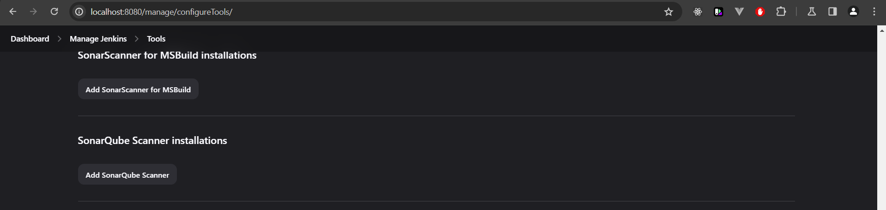
   - **Name**: SonarQube_Server
     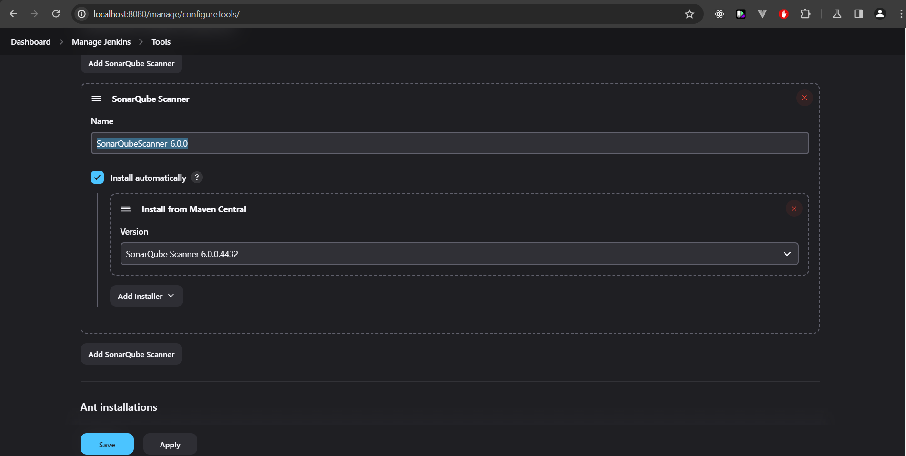
   - Then click the `Apply` and ``Save` button to finish adding the SonarQube Scanner.

5. **Integrate SonarQube in Your Jenkins Pipeline**:

   - Modify your Jenkinsfile to include a SonarQube analysis stage (Already done):

   ```groovy
   pipeline {
       agent any
       stages {
           stage('SonarQube Analysis') {
               steps {
                   script {
                       withSonarQubeEnv('SonarQube_Server') {
                           sh "mvn clean verify sonar:sonar"
                       }
                   }
               }
           }
       }
   }
   ```

   - This stage instructs Jenkins to run a Maven build and perform a SonarQube analysis using the SonarQube Scanner configured earlier.

6. **Review the Analysis**:
   - Once the Jenkins pipeline runs, navigate back to your SonarQube dashboard.
   - Check the project for any issues or vulnerabilities that have been identified.
     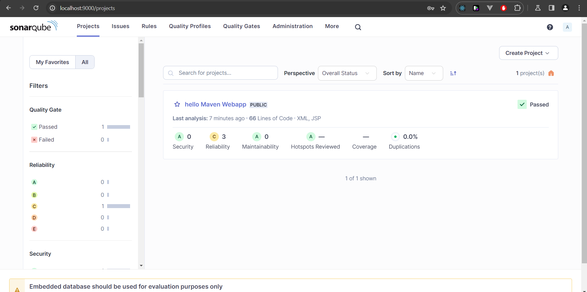
     In the image above the code was build and tested without any issues or vulnerabilities.

### 6. Setup Prometheus

Prometheus is used to monitor the metrics of your CI/CD environment. Here's how to set it up:

#### Create Prometheus Configuration File

1. **Configuration File**: The `prometheus.yml` should be prepared as outlined earlier. Ensure this file is saved in the same directory as your `docker-compose.yml`.

```yaml
global:
  scrape_interval: 15s # By default, scrape targets every 15 seconds.

scrape_configs:
  - job_name: "prometheus"
    static_configs:
      - targets: ["localhost:9090"]

  - job_name: "jenkins-master"
    static_configs:
      - targets: ["jenkins-master:8080"]

  - job_name: "jenkins-slave"
    static_configs:
      - targets: ["jenkins-slave:50000"]

  - job_name: "sonarqube"
    static_configs:
      - targets: ["sonarqube:9000"]

  - job_name: "grafana"
    static_configs:
      - targets: ["grafana:3000"]
```

2. **Place the File**: Make sure `prometheus.yml` is accessible to Prometheus by placing it in a directory mapped in the Docker Compose file.

### 7. Setup Grafana

Grafana is utilized to visualize metrics collected by Prometheus:

#### Accessing Grafana

1. **Open Grafana**: Access Grafana by navigating to `http://localhost:3000` in your web browser.
2. **Default Login**: The default login credentials are usually `admin` for both the username and password. You will be prompted to change the password after the first login.
   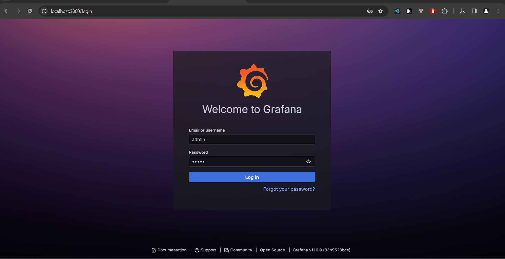
   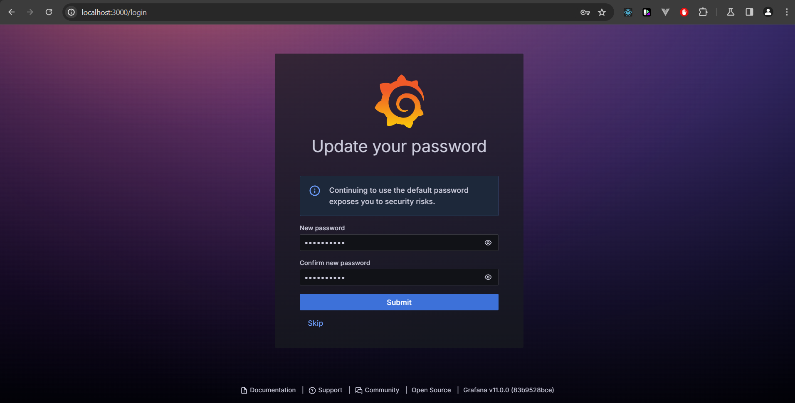

#### Configure Grafana to Use Prometheus

1. **Add Data Source**:
   - Go to **Connections > Data Sources** in the Grafana dashboard.
   - Click **Add data source**.
     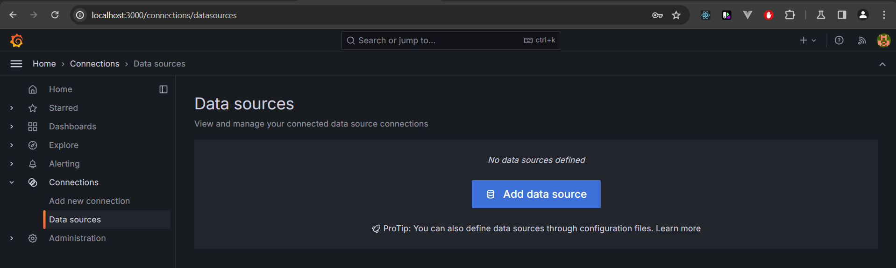
   - Choose **Prometheus** as the type.
   - Set the URL to `http://prometheus:9090`. This should match the service name and port in your Docker Compose setup.
     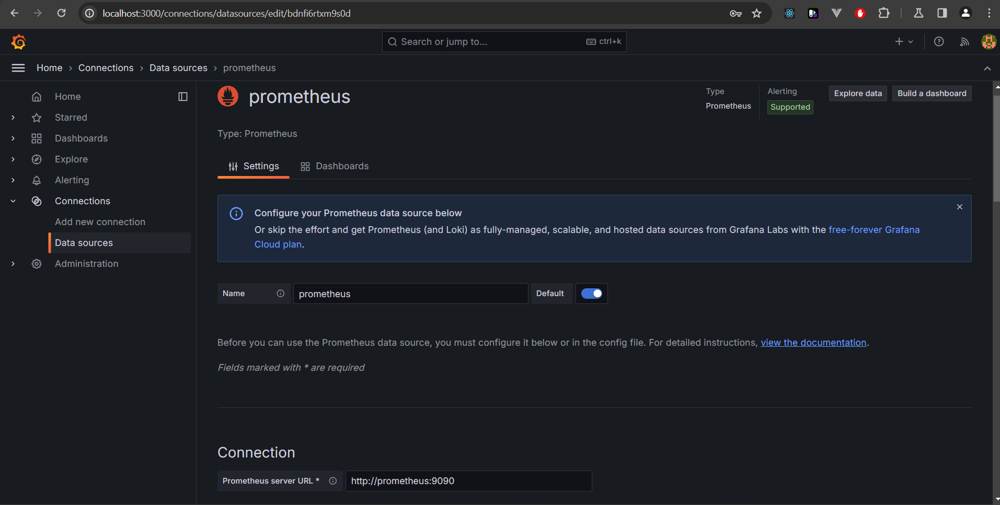
   - Click **Save & Test** to ensure Grafana can connect to Prometheus.

#### Create Dashboards

1. **Import Dashboards**:
   - Grafana offers a variety of pre-built dashboards which can be imported.
   - Go to **+ > Import**.
   - You can visit [Grafana Dashboards](https://grafana.com/grafana/dashboards/) to find and download appropriate dashboard JSON files for Jenkins, SonarQube, and Prometheus monitoring.
   - Upload or paste the JSON content and select the Prometheus data source you configured.
     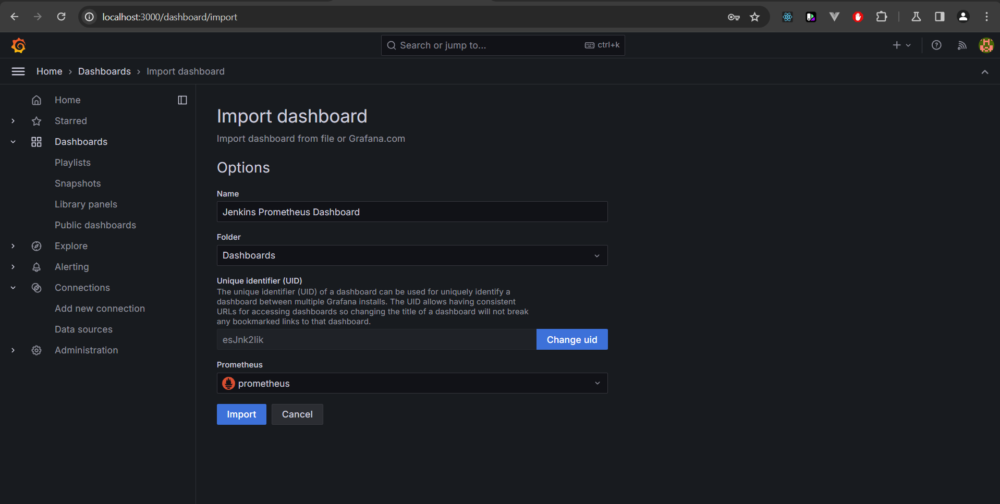

### 8. Testing and Validation

#### Test the Complete Setup

1. **Run a Build in Jenkins**:

   - Create a new job in Jenkins to run a simple build, or trigger an existing job. You can run the job that was previously build in the pipeline.
   - Ensure the build is executed on the Jenkins slave by configuring the job to use the slave label.
     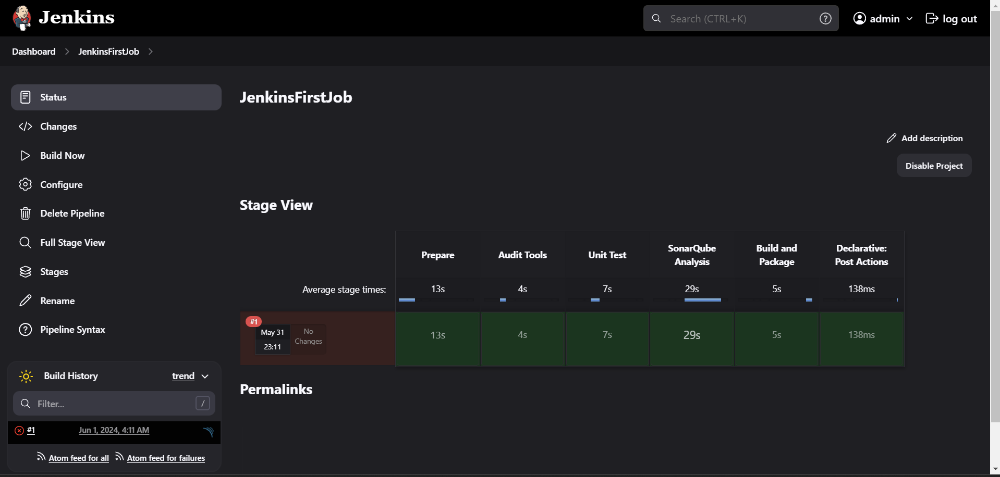

2. **Monitor Build Status**:

   - Check the build status on Jenkins to ensure it completes successfully.
   - Look for any errors in the build console output to ensure there are no connectivity or permission issues.

3. **Check SonarQube Analysis**:

   - Ensure that after the build, the code analysis is posted to SonarQube.
   - Check the SonarQube dashboard to see the analysis results.

4. **Verify Monitoring**:
   - Ensure Prometheus is scraping metrics by checking the targets status in the Prometheus web UI (`http://localhost:9090/targets`).
   - Go to Grafana and verify that the dashboards are displaying the data collected from Prometheus.

# Closing Remarks

The dissertation emphasizes the importance of integrating security and Infrastructure as Code (IaC) into the Software Development Life Cycle (SDLC) through the use of automation, particularly through the development and utilization of a CI/CD pipeline. Here's how the current implementation meets these requirements:

1. Integration of DevSecOps and IaC: The setup incorporates Docker, Docker Compose, Jenkins, SonarQube, Prometheus, and Grafana, which collectively support the automation of security and infrastructure management. This approach is consistent with DevSecOps practices that integrate security into every phase of the development process.

2. CI/CD Pipeline: The Docker Compose setup includes Jenkins for continuous integration and deployment, addressing the automation aspects crucial for your study. Jenkins, configured with both master and slave nodes, is essential for demonstrating the CI/CD pipeline in action, which is a core part of the research.

3. Monitoring and Feedback: With Prometheus and Grafana integrated into your setup, you are equipped to monitor and analyze the metrics and performance of your CI/CD environment. This setup allows for continuous monitoring and feedback, which are vital for optimizing the SDLC and enhancing security and performance, as highlighted in your dissertation.

4. Practical Implementation and Testing: Your configuration allows for practical tests and implementation scenarios, aligning with the methodology of building a CI/CD pipeline from scratch to gather data on the impact of automation on security and quality, as described in your dissertation.

This setup not only supports the practical aspects of your research but also provides a robust environment for experimenting with and demonstrating the key concepts of your dissertation on automating security and infrastructure within the SDLC.
